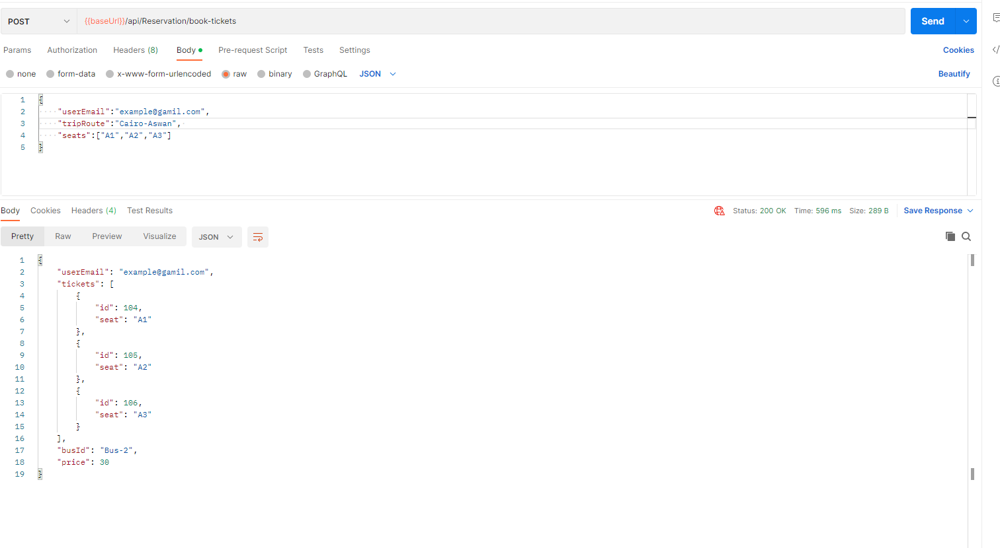
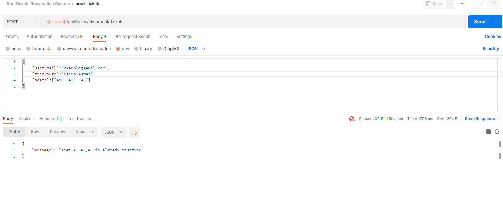

# Bus-Tickets-Reservation-System

Bus Tickets Reservation System is example of Restful Apis using asp.net core  

#### **Run Using Visual Studio**

1. **Open Solution**: Open your solution in Visual Studio.
2. **Set Startup Project**: Ensure your ASP.NET Core project is set as the startup project (right-click the project and choose "Set as Startup Project").
3. **Run the Application**: Press `F5` to run the application in debug mode or `Ctrl + F5` to run it without debugging. This will launch the application in your default browser.

#### This project contains two Apis.

1. Resevation in the bus and getting a ticket

test using Postman (you can also run a unit test project).
 

```
POST : {{baseUrl}}/api/Reservation/book-tickets
BODY:
{

    "userEmail":"example@gamil.com",

    "tripRoute":"Cairo-Aswan", 

    "seats":["A1","A2","A3"]

}
```



 Example of error 


2- API return the most frequent trip booked by each user

```
GET:{{baseUrl}}/api/Reservation/frequent-trip
```


#### Result of running Test cases


